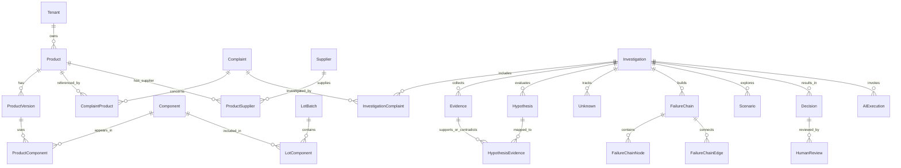

# MDARIX R1 Domain Model

## Status

PROPOSED for Day 1 architecture freeze.

## Mandatory Concept Distinctions

MDARIX must distinguish source fact, derived fact, AI inference, hypothesis, unknown, and human decision in the domain model, API, database design, UI, audit, and Investigation Brief.

## Canonical Entities

- Tenant
- Product
- ProductVersion
- Component
- Supplier
- ManufacturingSite
- LotBatch
- Requirement
- Change
- Complaint
- Investigation
- Risk
- FailureMode
- Control
- Evidence
- Hypothesis
- Unknown
- FailureChain
- Scenario
- Decision
- AIExecution
- HumanReview

## Relationship Entities

R1 should use explicit relationship/link entities when the relationship needs provenance, confidence, timestamps, evidence, or lifecycle meaning.

Candidate relationship entities:

- ProductComponent
- ProductSupplier
- LotComponent
- ComplaintProduct
- ComplaintLot
- InvestigationComplaint
- InvestigationEvidence
- HypothesisEvidence
- FailureChainNode
- FailureChainEdge

Do not blindly create every possible table. Day 2 derives the initial schema from this model.

## Source Record Provenance

Source-derived records must support tenant ID, source system, source record ID, source record version, raw payload reference, source timestamp, effective timestamp, ingestion timestamp, checksum, and data quality status where applicable.

## Architecture-Level ER Model

