# MDARIX R1 Database ERD

This Mermaid ER diagram was verified against the Day 2 implemented schema. It focuses on the major R1 canonical entities and relationship foundations rather than every audit/provenance column.

```mermaid
erDiagram
  tenants ||--o{ source_records : owns
  tenants ||--o{ products : owns
  tenants ||--o{ audit_events : records

  products ||--o{ product_versions : has
  products ||--o{ product_suppliers : uses
  suppliers ||--o{ product_suppliers : supplies
  product_versions ||--o{ product_components : uses
  components ||--o{ product_components : appears_in
  components ||--o{ component_suppliers : sourced_from
  suppliers ||--o{ component_suppliers : supplies
  product_versions ||--o{ lot_batches : produced_as
  manufacturing_sites ||--o{ lot_batches : produces
  lot_batches ||--o{ lot_components : contains
  components ||--o{ lot_components : traced_to

  products ||--o{ requirements : has
  product_versions ||--o{ requirements : refines
  products ||--o{ risks : has
  product_versions ||--o{ risks : contextualizes
  failure_modes ||--o{ risks : contributes_to

  products ||--o{ complaints : receives
  product_versions ||--o{ complaints : version_context
  lot_batches ||--o{ complaints : lot_context
  products ||--o{ investigations : investigated_under
  investigations ||--o{ investigation_complaints : includes
  complaints ||--o{ investigation_complaints : included_in
  investigations ||--o{ investigation_evidence : uses
  evidence ||--o{ investigation_evidence : referenced_by

  investigations ||--o{ evidence : collects
  investigations ||--o{ hypotheses : evaluates
  hypotheses ||--o{ hypothesis_evidence : mapped_to
  evidence ||--o{ hypothesis_evidence : supports_or_contradicts
  investigations ||--o{ unknowns : tracks
  hypotheses ||--o{ unknowns : may_have

  investigations ||--o{ failure_chains : builds
  failure_chains ||--o{ failure_chain_nodes : contains
  failure_chains ||--o{ failure_chain_edges : connects
  failure_chain_nodes ||--o{ failure_chain_edges : from_node
  failure_chain_nodes ||--o{ failure_chain_edges : to_node

  investigations ||--o{ scenarios : explores
  investigations ||--o{ ai_executions : invokes
  investigations ||--o{ decisions : results_in
  investigations ||--o{ human_reviews : reviewed_in
  ai_executions ||--o{ human_reviews : reviewed
  decisions ||--o{ human_reviews : supports

  evidence ||--o{ evidence_embeddings : embedded_as
  evidence ||--o{ reality_relationships : supports
```

