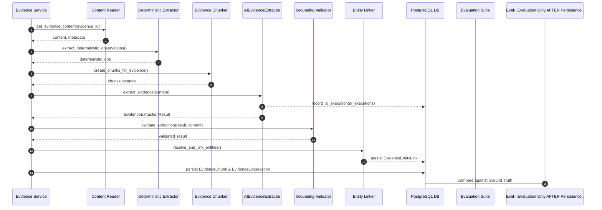

# MDARIX R1 Evidence Extraction Sequence Diagram

```mermaid
sequenceDiagram
    autonumber
    participant App as Evidence Service
    participant Reader as Content Reader
    participant Det as Deterministic Extractor
    participant Chunker as Evidence Chunker
    participant AI as AIEvidenceExtractor
    participant Val as Grounding Validator
    participant Linker as Entity Linker
    participant DB as PostgreSQL DB
    participant Eval as Evaluation Suite

    App->>Reader: get_evidence_content(evidence_id)
    Reader-->>App: content, metadata
    App->>Det: extract_deterministic_observations()
    Det-->>App: deterministic_obs
    App->>Chunker: create_chunks_for_evidence()
    Chunker-->>App: chunks locators
    App->>AI: extract_evidence(content)
    AI-->>DB: record_ai_execution(ai_executions)
    AI-->>App: EvidenceExtractionResult
    App->>Val: validate_extraction(result, content)
    Val-->>App: validated_result
    App->>Linker: resolve_and_link_entities()
    Linker-->>DB: persist EvidenceEntityLink
    App->>DB: persist EvidenceChunk & EvidenceObservation
    Eval-. Evaluation Only AFTER Persistence .-> DB: compare against Ground Truth
```
