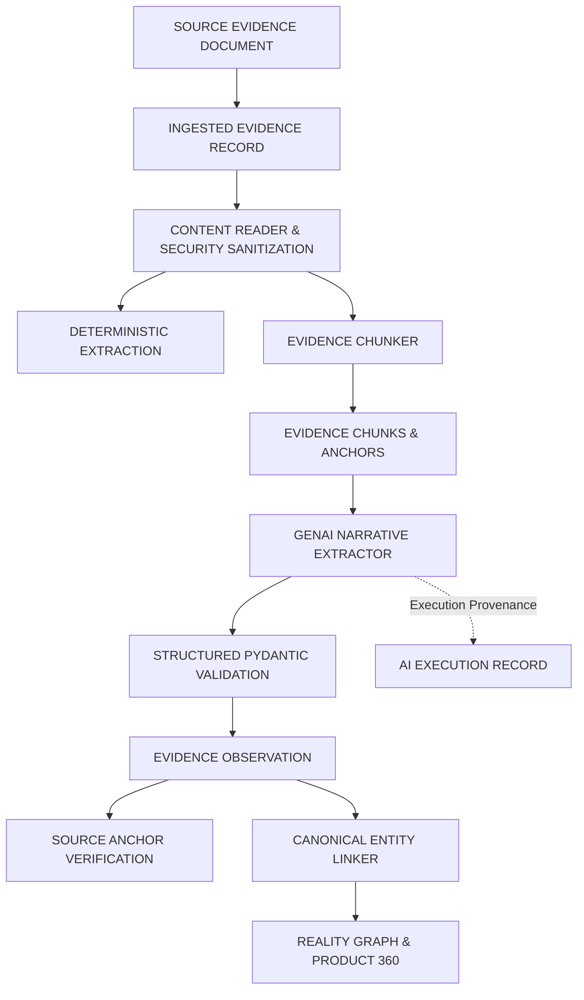

# MDARIX R1 Evidence Lineage Diagram

```mermaid
flowchart TD
    A[SOURCE EVIDENCE DOCUMENT] --> B[INGESTED EVIDENCE RECORD]
    B --> C[CONTENT READER & SECURITY SANITIZATION]
    C --> D[DETERMINISTIC EXTRACTION]
    C --> E[EVIDENCE CHUNKER]
    E --> F[EVIDENCE CHUNKS & ANCHORS]
    F --> G[GENAI NARRATIVE EXTRACTOR]
    G --> H[STRUCTURED PYDANTIC VALIDATION]
    H --> I[EVIDENCE OBSERVATION]
    I --> J[SOURCE ANCHOR VERIFICATION]
    I --> K[CANONICAL ENTITY LINKER]
    K --> L[REALITY GRAPH & PRODUCT 360]

    G -. Execution Provenance .-> M[AI EXECUTION RECORD]
```
