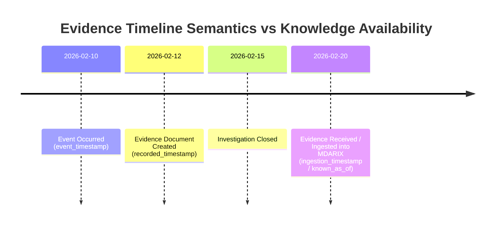

# MDARIX R1 Evidence Temporal Model Diagram

**Key Principle**:
Late-arriving evidence (`received_date` > `investigation_closed_date`) does NOT backdate knowledge. Historical queries using `known_as_of = 2026-02-15` will correctly exclude evidence received on `2026-02-20`.
