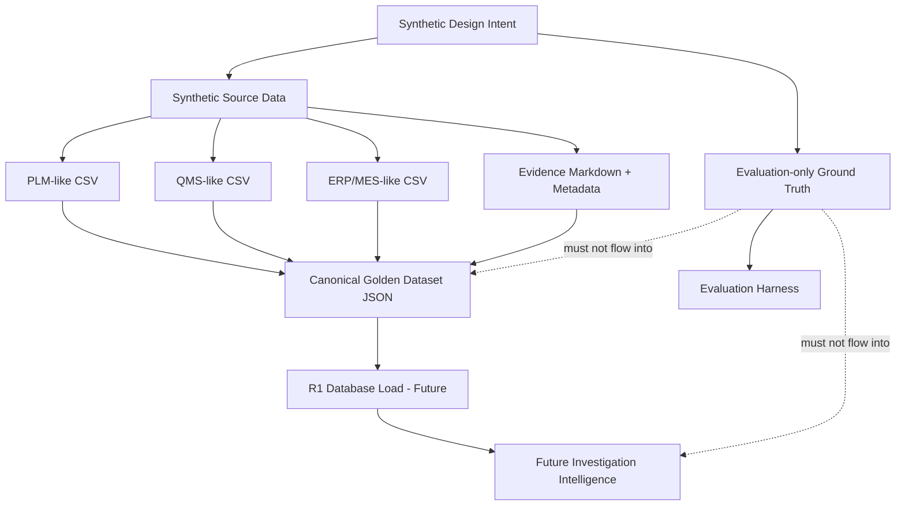

# MDARIX R1 Golden Data Lineage

```mermaid
flowchart TD
  Synthetic[Synthetic Design Intent] --> Source[Synthetic Source Data]
  Source --> PLM[PLM-like CSV]
  Source --> QMS[QMS-like CSV]
  Source --> ERP[ERP/MES-like CSV]
  Source --> Docs[Evidence Markdown + Metadata]
  PLM --> Canonical[Canonical Golden Dataset JSON]
  QMS --> Canonical
  ERP --> Canonical
  Docs --> Canonical
  Canonical --> DB[R1 Database Load - Future]
  DB --> Intelligence[Future Investigation Intelligence]

  Synthetic --> GroundTruth[Evaluation-only Ground Truth]
  GroundTruth --> Harness[Evaluation Harness]

  GroundTruth -. must not flow into .-> Canonical
  GroundTruth -. must not flow into .-> Intelligence
```
