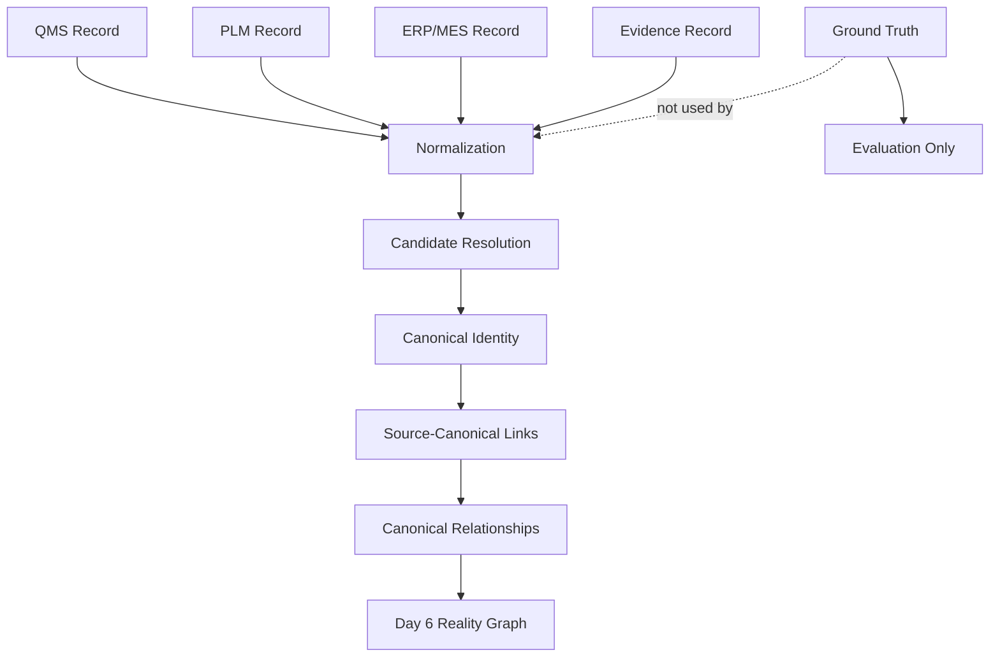

# R1 Identity Lineage

```mermaid
flowchart TD
    QMS[QMS Record] --> N[Normalization]
    PLM[PLM Record] --> N
    ERP[ERP/MES Record] --> N
    EVID[Evidence Record] --> N
    N --> CAND[Candidate Resolution]
    CAND --> CANON[Canonical Identity]
    CANON --> LINKS[Source-Canonical Links]
    LINKS --> REL[Canonical Relationships]
    REL --> DAY6[Day 6 Reality Graph]

    GT[Ground Truth] --> EVAL[Evaluation Only]
    GT -. not used by .-> N
```
