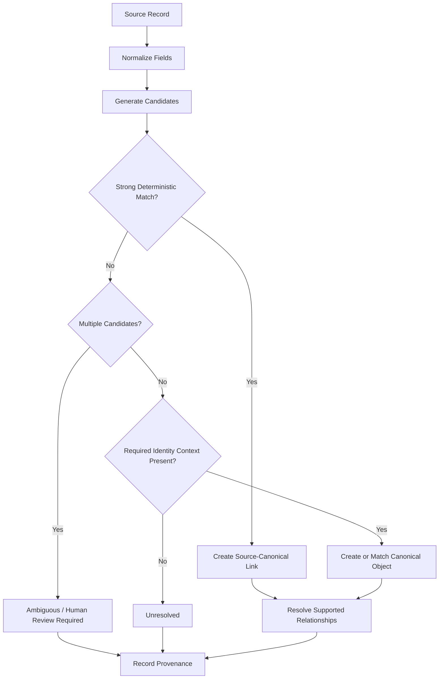

# R1 Identity Resolution Flow

```mermaid
flowchart TD
    SRC[Source Record] --> NORMALIZE[Normalize Fields]
    NORMALIZE --> CANDIDATES[Generate Candidates]
    CANDIDATES --> STRONG{Strong Deterministic Match?}
    STRONG -->|Yes| MATCH[Create Source-Canonical Link]
    STRONG -->|No| MULTI{Multiple Candidates?}
    MULTI -->|Yes| REVIEW[Ambiguous / Human Review Required]
    MULTI -->|No| MISSING{Required Identity Context Present?}
    MISSING -->|Yes| NEW[Create or Match Canonical Object]
    MISSING -->|No| UNRESOLVED[Unresolved]
    MATCH --> REL[Resolve Supported Relationships]
    NEW --> REL
    REVIEW --> PROV[Record Provenance]
    UNRESOLVED --> PROV
    REL --> PROV
```
