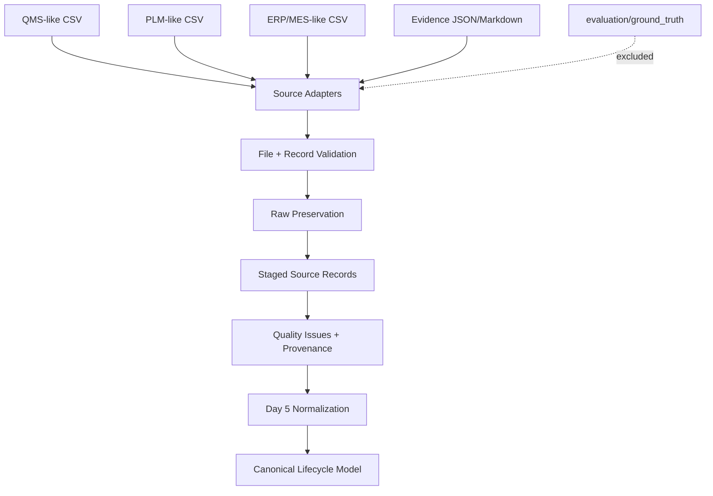

# MDARIX R1 Ingestion Lineage

```mermaid
flowchart TD
  QMS[QMS-like CSV] --> Adapters[Source Adapters]
  PLM[PLM-like CSV] --> Adapters
  ERP[ERP/MES-like CSV] --> Adapters
  Evidence[Evidence JSON/Markdown] --> Adapters
  Adapters --> Validation[File + Record Validation]
  Validation --> Raw[Raw Preservation]
  Raw --> Staging[Staged Source Records]
  Staging --> Quality[Quality Issues + Provenance]
  Quality --> Day5[Day 5 Normalization]
  Day5 --> Canonical[Canonical Lifecycle Model]

  GroundTruth[evaluation/ground_truth] -. excluded .-> Adapters
```
