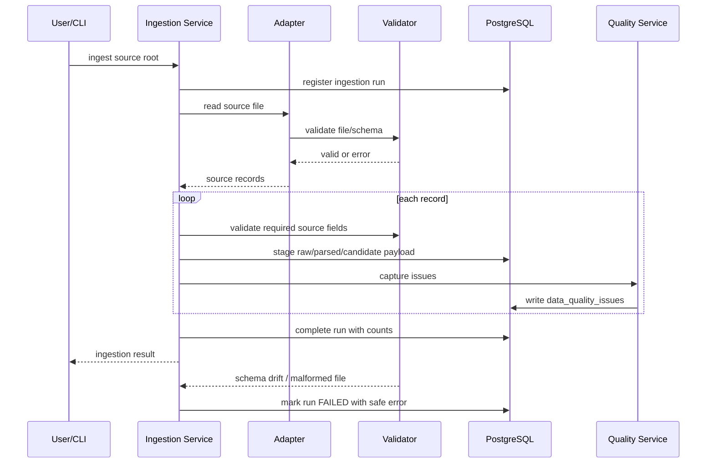

# MDARIX R1 Ingestion Sequence

```mermaid
sequenceDiagram
  participant CLI as User/CLI
  participant S as Ingestion Service
  participant A as Adapter
  participant V as Validator
  participant DB as PostgreSQL
  participant Q as Quality Service

  CLI->>S: ingest source root
  S->>DB: register ingestion run
  S->>A: read source file
  A->>V: validate file/schema
  V-->>A: valid or error
  A-->>S: source records
  loop each record
    S->>V: validate required source fields
    S->>DB: stage raw/parsed/candidate payload
    S->>Q: capture issues
    Q->>DB: write data_quality_issues
  end
  S->>DB: complete run with counts
  S-->>CLI: ingestion result

  V-->>S: schema drift / malformed file
  S->>DB: mark run FAILED with safe error
```
