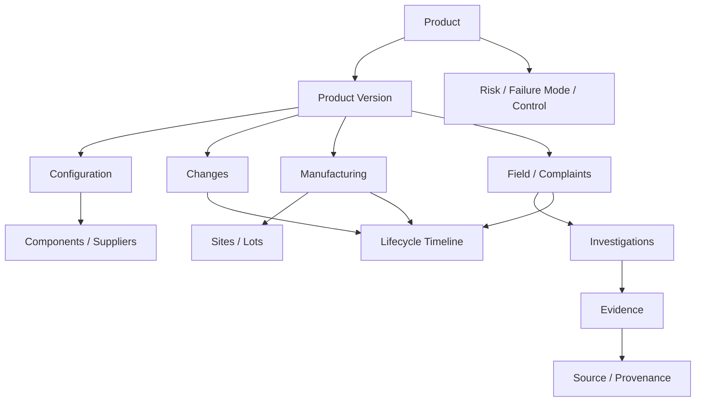

# R1 Product 360 View

```mermaid
flowchart TD
    P[Product] --> PV[Product Version]
    PV --> CONFIG[Configuration]
    PV --> CHANGES[Changes]
    PV --> MFG[Manufacturing]
    CONFIG --> COMPONENTS[Components / Suppliers]
    MFG --> LOTS[Sites / Lots]
    PV --> FIELD[Field / Complaints]
    FIELD --> INVEST[Investigations]
    INVEST --> EVIDENCE[Evidence]
    P --> RISK[Risk / Failure Mode / Control]
    EVIDENCE --> PROV[Source / Provenance]
    FIELD --> TIMELINE[Lifecycle Timeline]
    CHANGES --> TIMELINE
    MFG --> TIMELINE
```
