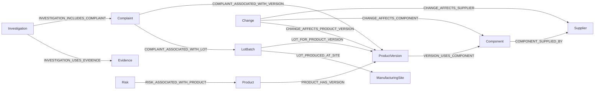

# R1 Reality Graph Implementation

```mermaid
flowchart LR
    P[Product] -->|PRODUCT_HAS_VERSION| PV[ProductVersion]
    PV -->|VERSION_USES_COMPONENT| C[Component]
    C -->|COMPONENT_SUPPLIED_BY| S[Supplier]
    CHG[Change] -->|CHANGE_AFFECTS_SUPPLIER| S
    CHG -->|CHANGE_AFFECTS_COMPONENT| C
    CHG -->|CHANGE_AFFECTS_PRODUCT_VERSION| PV
    L[LotBatch] -->|LOT_FOR_PRODUCT_VERSION| PV
    L -->|LOT_PRODUCED_AT_SITE| MS[ManufacturingSite]
    CMP[Complaint] -->|COMPLAINT_ASSOCIATED_WITH_VERSION| PV
    CMP -->|COMPLAINT_ASSOCIATED_WITH_LOT| L
    INV[Investigation] -->|INVESTIGATION_INCLUDES_COMPLAINT| CMP
    INV -->|INVESTIGATION_USES_EVIDENCE| EV[Evidence]
    R[Risk] -->|RISK_ASSOCIATED_WITH_PRODUCT| P
```
