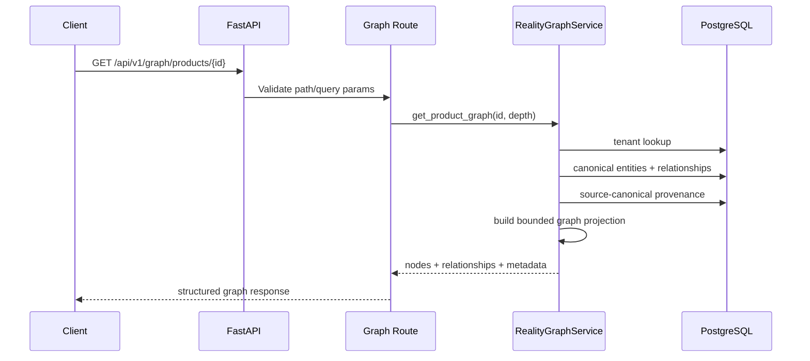

# R1 Reality Graph Request Sequence

```mermaid
sequenceDiagram
    participant Client
    participant API as FastAPI
    participant Route as Graph Route
    participant Service as RealityGraphService
    participant DB as PostgreSQL

    Client->>API: GET /api/v1/graph/products/{id}
    API->>Route: Validate path/query params
    Route->>Service: get_product_graph(id, depth)
    Service->>DB: tenant lookup
    Service->>DB: canonical entities + relationships
    Service->>DB: source-canonical provenance
    Service->>Service: build bounded graph projection
    Service-->>Route: nodes + relationships + metadata
    Route-->>Client: structured graph response
```
