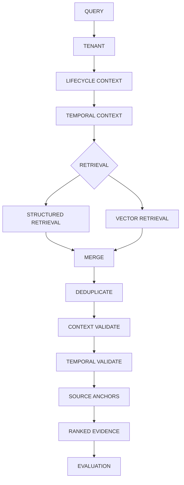

# R1 Retrieval Flow

```mermaid
flowchart TD
    A[QUERY] --> B[TENANT]
    B --> C[LIFECYCLE CONTEXT]
    C --> D[TEMPORAL CONTEXT]
    D --> E{RETRIEVAL}
    E --> F[STRUCTURED RETRIEVAL]
    E --> G[VECTOR RETRIEVAL]
    F --> H[MERGE]
    G --> H
    H --> I[DEDUPLICATE]
    I --> J[CONTEXT VALIDATE]
    J --> K[TEMPORAL VALIDATE]
    K --> L[SOURCE ANCHORS]
    L --> M[RANKED EVIDENCE]
    M --> N[EVALUATION]
```
