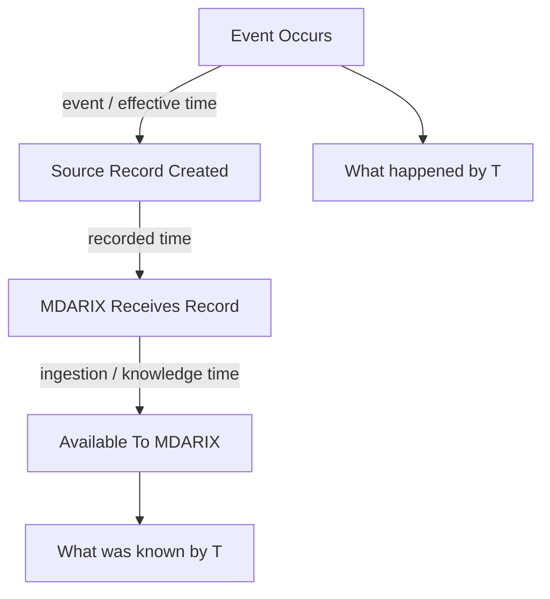

# R1 Temporal Reality

```mermaid
flowchart TD
    EVENT[Event Occurs] -->|event / effective time| SOURCE[Source Record Created]
    SOURCE -->|recorded time| INGEST[MDARIX Receives Record]
    INGEST -->|ingestion / knowledge time| AVAILABLE[Available To MDARIX]
    EVENT --> HAPPENED[What happened by T]
    AVAILABLE --> KNOWN[What was known by T]
```
