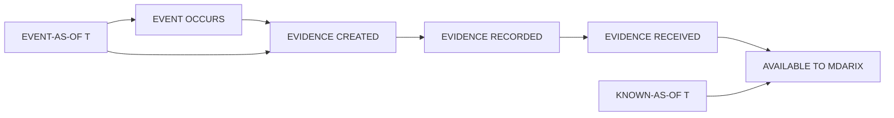

# R1 Temporal Retrieval

```mermaid
flowchart LR
    A[EVENT OCCURS] --> B[EVIDENCE CREATED]
    B --> C[EVIDENCE RECORDED]
    C --> D[EVIDENCE RECEIVED]
    D --> E[AVAILABLE TO MDARIX]

    F[EVENT-AS-OF T] --> A
    F --> B
    G[KNOWN-AS-OF T] --> E
```

`EVENT-AS-OF T` uses lifecycle event/effective time. `KNOWN-AS-OF T` uses availability/ingestion time and prevents future evidence leakage.
