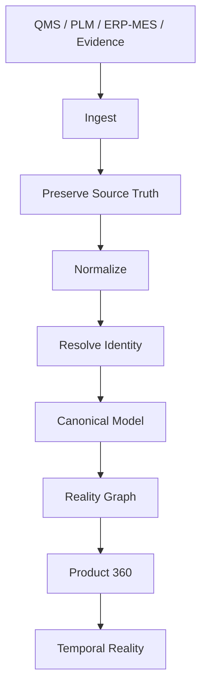

# R1 Week 1 End To End

```mermaid
flowchart TD
    SRC[QMS / PLM / ERP-MES / Evidence] --> INGEST[Ingest]
    INGEST --> PRESERVE[Preserve Source Truth]
    PRESERVE --> NORMALIZE[Normalize]
    NORMALIZE --> IDENTITY[Resolve Identity]
    IDENTITY --> CANON[Canonical Model]
    CANON --> GRAPH[Reality Graph]
    GRAPH --> P360[Product 360]
    P360 --> TEMPORAL[Temporal Reality]
```
